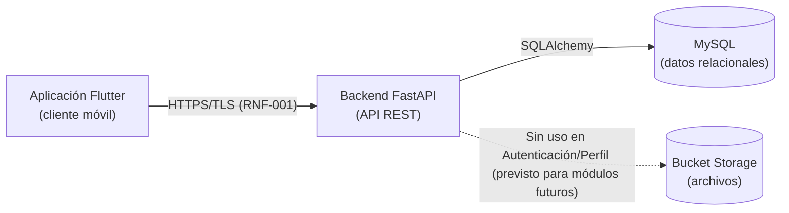
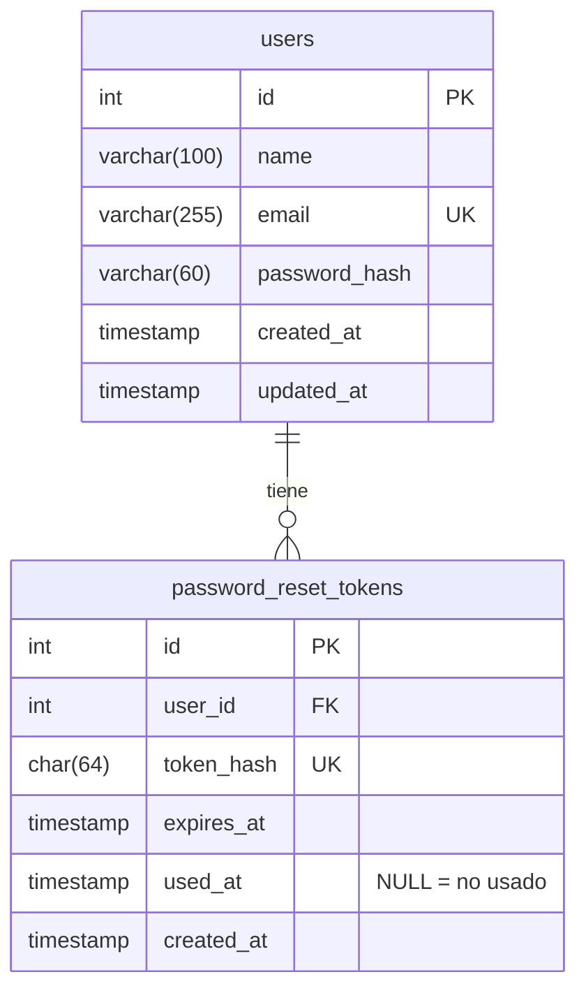
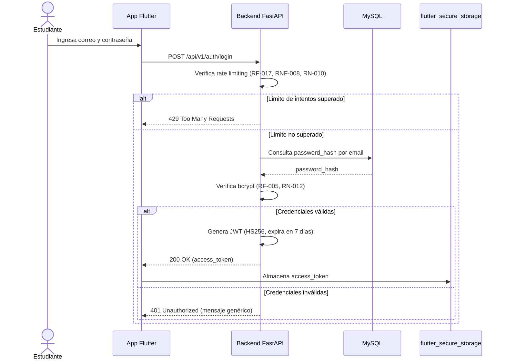
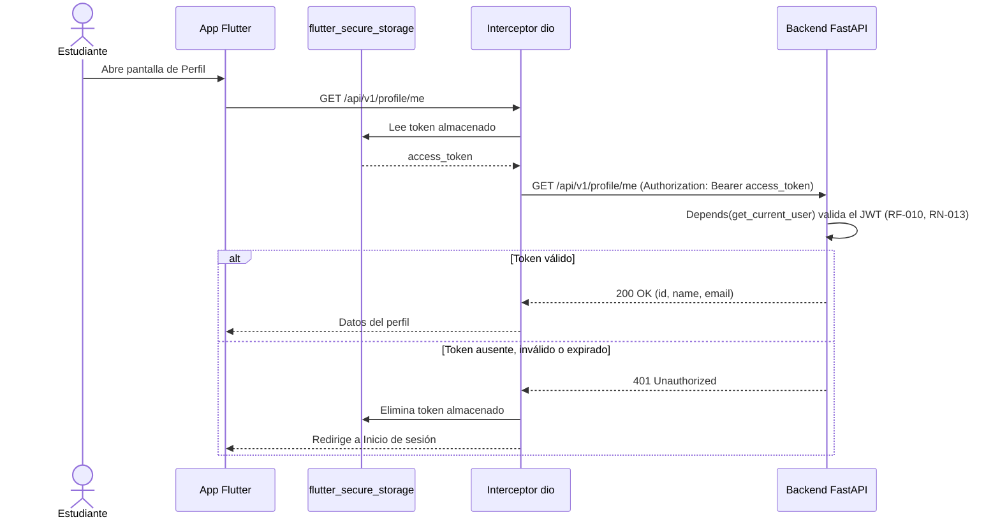
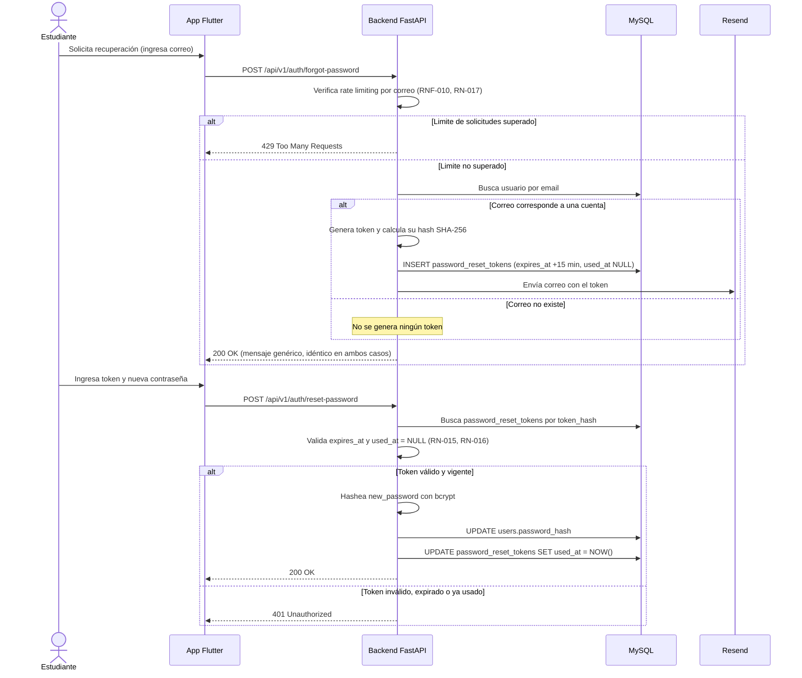

# Diagramas del Sistema — Stunex

## Propósito del documento

El presente documento consolida visualmente, mediante diagramas Mermaid, las decisiones ya tomadas y aprobadas en los documentos de diseño anteriores. **Este documento no toma decisiones nuevas**: cada diagrama es una representación gráfica de contenido ya documentado, y bajo cada uno se referencia el documento y la sección exacta que lo respalda.

Si algún diagrama de este documento no coincidiera con lo ya documentado en un archivo anterior de `docs/03-Diseno/`, el error está en el diagrama, no en el documento previo. Ante cualquier discrepancia, prevalece siempre el documento textual ya aprobado.

---

# 1. Alcance de este documento

Este documento incluye exactamente **cuatro diagramas**:

1. Arquitectura general del sistema.
2. Entidad-relación de la base de datos.
3. Secuencia de autenticación (login y acceso a endpoint protegido).
4. Secuencia de recuperación de contraseña.

Al igual que los documentos anteriores, estos diagramas cubren únicamente lo ya diseñado para **Autenticación** y **Perfil**. Ningún diagrama incluye elementos, tablas, endpoints ni flujos de los módulos restantes del alcance del MVP (Materias, Tareas, Calendario, Horario, Recursos, Documentos, Dashboard, Herramientas), por no contar aún con RF, RNF ni RN aprobados (ver sección 8).

**No se incluye un diagrama de casos de uso UML.** Esa información ya está documentada en `docs/02-Requisitos/04_Casos_de_Uso.md` (CU-001 a CU-007); representarla nuevamente en un diagrama UML crearía dos fuentes de verdad para el mismo contenido, con el riesgo de que ambas versiones diverjan con el tiempo. Los diagramas de secuencia de este documento (secciones 5 y 6) ilustran esos mismos casos de uso desde una perspectiva técnica de interacción entre componentes, sin duplicar su descripción funcional.

---

# 2. Formato de los diagramas: Mermaid

Todos los diagramas de este documento se expresan en **Mermaid**, embebido directamente en bloques de código Markdown. Razones:

- **Renderizado nativo en GitHub:** GitHub interpreta los bloques ` ```mermaid ` y los muestra como diagramas reales en la interfaz web del repositorio, no como bloques de texto plano.
- **Editable sin herramientas externas:** cualquier persona con acceso al repositorio puede modificar un diagrama editando texto, sin depender de un editor gráfico propietario ni de archivos binarios.
- **Versionado como texto:** al ser texto plano, los diagramas se versionan en Git de la misma forma que el resto de la documentación, permitiendo ver diffs legibles entre revisiones.

---

# 3. Diagrama 1 — Arquitectura general



**Descripción:** la aplicación Flutter se comunica con el backend FastAPI exclusivamente sobre HTTPS/TLS. El backend persiste los datos de usuarios y perfiles en MySQL mediante SQLAlchemy. La conexión hacia Bucket Storage se representa con línea punteada porque, en el alcance actual (Autenticación y Perfil), **no existe interacción real** con ese componente: ningún RF vigente la requiere; está previsto únicamente para los futuros módulos de Documentos y Recursos.

**Referencia:** `01_Arquitectura.md`, sección 2 (flujo general del sistema) y secciones 3.3–3.4 (responsabilidad de MySQL y Bucket Storage).

---

# 4. Diagrama 2 — Entidad-relación



**Descripción:** un usuario (`users`) puede tener cero o varios tokens de restablecimiento (`password_reset_tokens`) a lo largo del tiempo (relación 1:N). No existe una tabla "perfil" separada: `users` respalda tanto al dominio `auth/` como al dominio `profile/`.

**Referencia:** `04_Modelo_Base_de_Datos.md`, secciones 2 (tabla `users`), 3 (tabla `password_reset_tokens`) y 4 (diagrama entidad-relación en texto que este diagrama traduce a Mermaid).

---

# 5. Diagrama 3 — Secuencia de autenticación

## 5.1 Login exitoso



## 5.2 Acceso a endpoint protegido



**Descripción:** el primer diagrama (5.1) cubre, antes de procesar las credenciales, la verificación del límite de intentos de inicio de sesión (rate limiting: máximo 5 intentos fallidos en 15 minutos por cuenta/IP, respondiendo 429 si se supera); si el límite no se supera, continúa con la generación del token: verificación de credenciales contra el hash bcrypt almacenado, generación del JWT firmado con HS256 con expiración de 7 días, y su almacenamiento en `flutter_secure_storage`. El segundo diagrama (5.2) cubre el acceso a un endpoint protegido: el interceptor de `dio` inyecta el token almacenado, `Depends(get_current_user)` lo valida en el backend, y ante un 401 el interceptor elimina el token y redirige al inicio de sesión.

**Referencia:** `03_Arquitectura_Backend.md`, sección 7.1 (generación del JWT) y 7.2 (validación mediante `Depends()`); `05_Diseno_API.md`, secciones 4.2 (`POST /auth/login`) y 4.5 (`GET /profile/me`); `02_Arquitectura_Movil.md`, sección 5 (comportamiento concreto ante una respuesta 401) y sección 7 (almacenamiento seguro del token).

---

# 6. Diagrama 4 — Secuencia de recuperación de contraseña



**Descripción:** antes de procesar la solicitud de recuperación, se verifica el límite de solicitudes por correo (rate limiting: máximo 1 solicitud cada 5 minutos, respondiendo 429 si se supera). Si el límite no se supera, `forgot-password` responde siempre con el mismo mensaje genérico, exista o no una cuenta asociada al correo; internamente, solo si la cuenta existe se genera un token (almacenado como hash SHA-256, con vigencia de 15 minutos) y se envía por correo mediante Resend. El restablecimiento (`reset-password`) valida que el token exista, esté vigente y no haya sido usado antes de actualizar la contraseña, y marca el token como usado mediante `used_at` para impedir su reutilización.

**Referencia:** `03_Arquitectura_Backend.md`, sección 7.5 (recuperación de contraseña); `04_Modelo_Base_de_Datos.md`, secciones 3.1 (almacenamiento hasheado del token) y 3.2 (uso único mediante `used_at`); `05_Diseno_API.md`, secciones 4.3 (`POST /auth/forgot-password`) y 4.4 (`POST /auth/reset-password`); `01_Arquitectura.md`, sección 6.6 (Resend como servicio de correo).

---

# 7. Trazabilidad de este documento

| Diagrama | RF | RNF | RN | HU/CU |
|---|---|---|---|---|
| 1 — Arquitectura general | — | RNF-001 | — | — |
| 2 — Entidad-relación | RF-001, RF-002, RF-005, RF-013 | RNF-007, RNF-018 | RN-001, RN-011, RN-012, RN-015, RN-016 | CU-001, CU-004 |
| 3.1 — Login exitoso | RF-005 a RF-008, RF-011, RF-017 | RNF-004, RNF-005, RNF-008 | RN-010, RN-012, RN-014 | HU-002, CU-002 |
| 3.2 — Acceso a endpoint protegido | RF-010, RF-011 | — | RN-013 | HU-006, CU-005, CU-006 |
| 4 — Recuperación de contraseña | RF-012, RF-013, RF-014 | RNF-009, RNF-010 | RN-014, RN-015, RN-016, RN-017 | HU-004, HU-005, CU-004 |

---

# 8. Diagramas pendientes para módulos futuros

Los siguientes módulos del alcance del MVP no cuentan con diagramas en este documento, por no tener aún RF, RNF ni RN aprobados: Materias, Tareas, Calendario, Horario, Recursos, Documentos, Dashboard y Herramientas (Calculadora de notas, Temporizador Pomodoro).

Ningún diagrama de arquitectura, entidad-relación ni secuencia de esos módulos se documenta ni se infiere aquí. Se agregarán a este documento en actualizaciones futuras, una vez cada módulo complete su fase de requisitos y su diseño correspondiente, siguiendo la misma metodología incremental aplicada a Autenticación y Perfil. El Diagrama 1 (arquitectura general) se actualizaría en ese momento para mostrar la interacción real con Bucket Storage, actualmente representada como prevista pero sin uso (sección 3).
